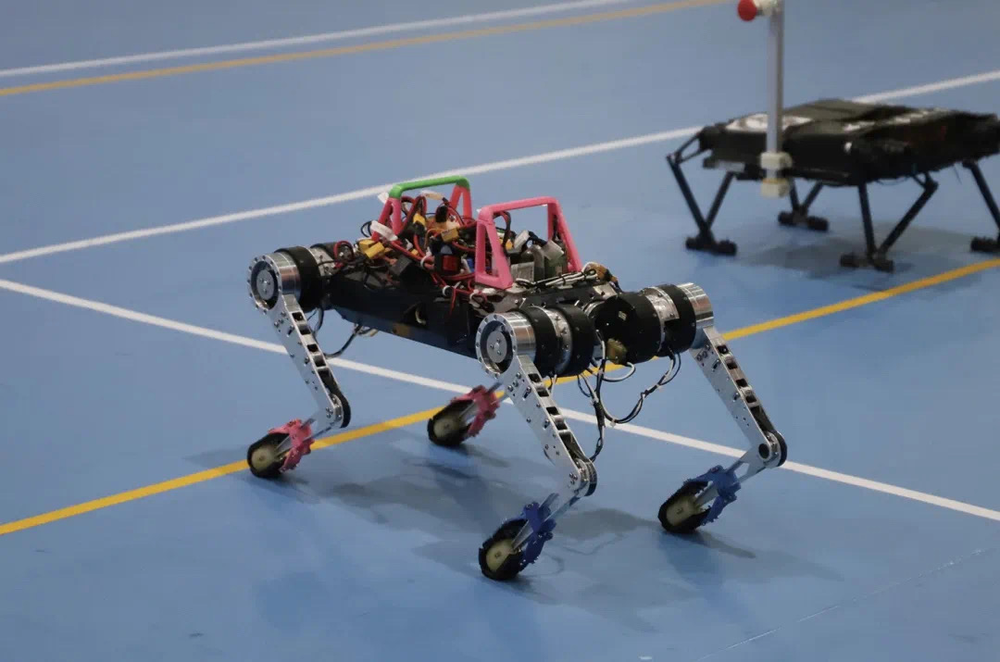
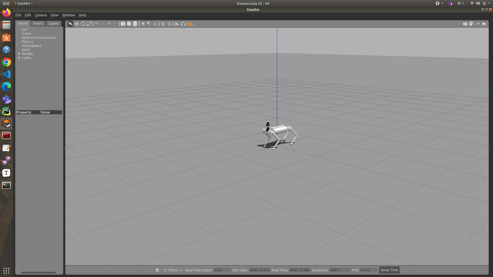
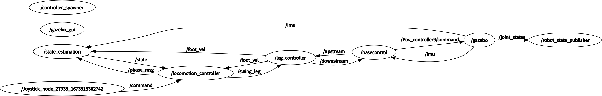
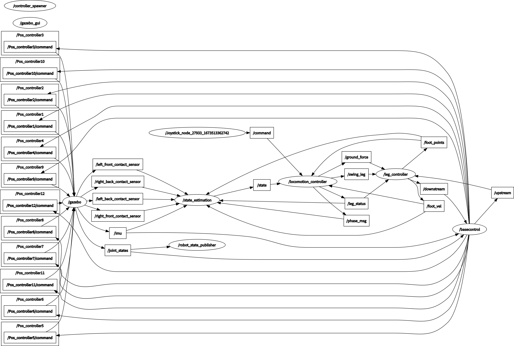

# Quadruped Robot for ROBOCON 2021
- A 12-DOF force control quadruped robot based on QP
- deployed In both Gazebo simulation and real world 

# Dependencies
- Ros Melodic
- PYTHON: Numpy, OSQP 
- C++: Eigen3, OSQP, OSQP-Eigen
# package
- locomotion_controller: optimization contact force & schedule gait @ 100HZ
- leg_controller : calculate Jacobian & impedence control @1000HZ
- state_estimation: extended kalman filter localization @500Hz
- stm32_Communication: communication with 2 stm32 and control Unitree A1 motor @1000HZ
- dog_sim: gazebo simulation

# Developer
- Runyu Ma
- Qinshu Chen